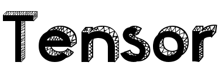
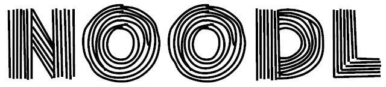

## TensorNOODL
{: .centered }

<!--
 -->


A Matlab package for provable structured CP/PARAFAC tensor factorization via dictionary learning for exact recovery of the constituent factors.

{: .centered }
[Download TensorNOODL](https://github.com/srambhatla/TensorNOODL)

Kindly acknowledge TensorNOODL as
>"S. Rambhatla, X. Li, and J. Haupt (2020). Provable Online CP/PARAFAC Decomposition of a Structured Tensor via Dictionary Learning. _Neural Information Processing Systems (NeurIPS)_ https://arxiv.org/abs/2006.16442

BibTeX:
```
@article{rambhatla2020provable,
  title={Provable Online CP/PARAFAC Decomposition of a Structured Tensor via Dictionary Learning},
  author={Rambhatla, Sirisha and Li, Xingguo and Haupt, Jarvis},
  journal={Neural Information Processing Systems (NeurIPS)},
  year={2020}
}
```

## NOODL
{: .centered }

A scalable Matlab and TensorFlow package for provable online dictionary learning.

{: .centered }
[Download NOODL](https://github.com/srambhatla/NOODL)

Kindly acknowledge NOODL as
>"S. Rambhatla, X. Li, and J. Haupt (2019). NOODL: Provable Online Dictionary Learning and Sparse Coding. _International Conference on Learning Representations (ICLR)_ https://openreview.net/forum?id=HJeu43ActQ

BibTeX:
```
@inproceedings{rambhatla2018noodl,
  title={NOODL: Provable Online Dictionary Learning and Sparse Coding},
  author={Rambhatla, Sirisha and Li, Xingguo and Haupt, Jarvis},
  booktitle={International Conference on Learning Representations},
  year={2019}
}
```

## Dictionary-based Generalization of Robust PCA (DRPCA)
{: .centered }


A Matlab package for demixing a matrix as a superposition of a low-rank component and a dictionary sparse component (multiple sparsity modalities are available) with applications to Target localization in Hyperspectral images. 

{: .centered }
[Download DRPCA](https://github.com/srambhatla/Dictionary-based-Robust-PCA)

Kindly acknowledge DRPCA as
>"S. Rambhatla, X. Li, J. Ren and J. Haupt, "A Dictionary-Based Generalization of Robust PCA With Applications to Target Localization in Hyperspectral Imaging," in IEEE Transactions on Signal Processing, vol. 68, pp. 1760-1775, 2020, doi: 10.1109/TSP.2020.2977458."

BibTeX:
```
@ARTICLE{rambhatlaDRPCA2020,
  author={S. {Rambhatla} and X. {Li} and J. {Ren} and J. {Haupt}},
  journal={IEEE Transactions on Signal Processing}, 
  title={A Dictionary-Based Generalization of Robust PCA With Applications to Target Localization in Hyperspectral Imaging}, 
  year={2020},
  volume={68},
  pages={1760-1775},}
```
 
## TensorMap
{: .centered }

A Matlab package for developing topological maps for vehicle navigation using tensor decompositions. 

{: .centered }
[Download TensorMap](https://github.com/srambhatla/TensorMap)

Kindly acknowledge TensorMap as
>"S. Rambhatla, N. D. Sidiropoulos and J. Haupt, "TensorMap: Lidar-based Topological Mapping and Localization via Tensor Decompositons}," 2018 IEEE Global Conference on Signal and Information Processing (GlobalSIP), Anaheim, CA, USA, 2018, pp. 1368-1372, doi: 10.1109/GlobalSIP.2018.8646665"

BibTeX:
```
@INPROCEEDINGS{rambhatlaTensorMap2018,
  author={S. {Rambhatla} and N. D. {Sidiropoulos} and J. {Haupt}},
  booktitle={2018 IEEE Global Conference on Signal and Information Processing (GlobalSIP)}, 
  title={TensorMap: Lidar-based Topological Mapping and Localization via Tensor Decompositons}, 
  year={2018},
  pages={1368-1372},}
```

<!--
<a href="./figures/twodhist.png" data-lightbox="jLab-gallery" data-title="TWODHIST&mdash;Very fast two-dimensional histograms of large datasets, here applied to the global surface drifter dataset in DRIFTERS.MAT.  Parallelized if the Parallel Computing Toolbox is installed.">{gallery}</a>
<a href="./figures/twodstats.png" data-lightbox="jLab-gallery" data-title="TWODSTATS&mdash;Very fast two-dimensional means and standard deviations of large datasets. Here the mean speed current speed from the global surface drifter dataset in DRIFTERS.MAT is shown.  TWODMED similarly computes the median.  Parallelized if the Parallel Computing Toolbox is installed."></a>
<a href="./figures/polysmooth.png" data-lightbox="jLab-gallery" data-title="POLYSMOOTH&mdash;A very flexible, powerful routine for mapping scattered data.  This method,  based on local polynomial fitting, was developed by the author for the Aquarius mission.  Here POLYSMOOTH is used to map alongtrack standard deviations of sea surface height from the TOPEX/Poseidon/Jason/Ocean Surface Topography Mission satellites in TPJAOS.MAT."></a>
<a href="./figures/sphereinterp1.png" data-lightbox="jLab-gallery" data-title="SPHEREINTERP&mdash;A very fast method for linearly interpolating non-plaid data on the sphere, as often arises in ocean modeling.  Here SPHEREINTERP is used to map sea surface height from the tripolar grid used in the GOLD model, to a regular lat/lon grid.  The quantity shown is sea surface height gradient magnitude.  GOLD model fields courtesy of Harper Simmons at the University of Alaska Fairbanks."></a>
<a href="./figures/topoplot.png" data-lightbox="jLab-gallery" data-title="TOPOPLOT&mdash;Convenient plotting of continents and bathymetry at 1/6 degree resolution, globally or regionally."></a>
<a href="./figures/mspec.png" data-lightbox="jLab-gallery" data-title="MSPEC&mdash;Spectral analysis using the multitaper method, suitable for very large datasets. Parallelized if the Parallel Computing Toolbox is installed.  Here rotary spectra from a current meter mooring in the subpolar North Atlantic are shown, illustrating the improvement over the periodogram."></a>
<a href="./figures/morsewave.png" data-lightbox="jLab-gallery" data-title="MORSEWAVE&mdash;The generalized Morse wavelets: arguably the quintessential family of continuous analytic wavelets, subsuming eight other types of wavelets.  Here examples of time-domain forms are shown, with real parts, imaginary parts, and magnitudes all drawn separately."></a>
<a href="./figures/wavetrans.png" data-lightbox="jLab-gallery" data-title="WAVETRANS&mdash;A powerful wavelet transform routine based on the generalized Morse wavelets, with numerous options and suitable for large datasets.  Here an application to a current meter mooring in the subpolar North Atlantic is shown."></a>
<a href="./figures/closedcurves.png" data-lightbox="jLab-gallery" data-title="CLOSEDCURVES&mdash;  Identification of closed curves for eddy analysis, with support for periodic domains, here applied to a simulation of quasi-geostrophic turbulence. "></a>
<a href="./figures/curvemoments.png" data-lightbox="jLab-gallery" data-title="CURVEMOMENTS&mdash; Physical properties along closed curves for eddy analysis, with support for periodic domains, here applied to a simulation of quasi-geostrophic turbulence."></a>
{: .centered }
         
Version 1.6.6 introduces several dozen improvements as well as ten new functions, including [ncload](./doc/ncload.html) for easy reading of NetCDF files and [interplatlon](./doc/interplatlon.html) for interpolation on the sphere. See the [changelog](./doc/jlab_changes.html) for details.

[jLab, 130 Mb zip](hhttps://github.com/jonathanlilly/jLab/archive/master.zip)
{: .centered}

To install jLab, after unzipping, rename the top-level directory to “jlab”. Put “addpath /your/path/to/jlab” followed by “jlab_addpath” into your startup.m file, and type “startup” at the Matlab prompt. Then kindly type “jlab_runtests” and follow the instructions.

To get started, type  “help jlab”  or browse the extensive online [documentation](./doc/jLab.html).

Kindly acknowledge jLab in scientific publications as
> “Lilly, J. M. (2019), jLab: A data analysis package for Matlab, v. 1.6.6, http://www.jmlilly.net/jmlsoft.html.”
-->

To comment, contribute, or report issues, visit the hosting page at [GitHub](https://github.com/srambhatla/), or else [email me](mailto:sirishar@usc.edu).

